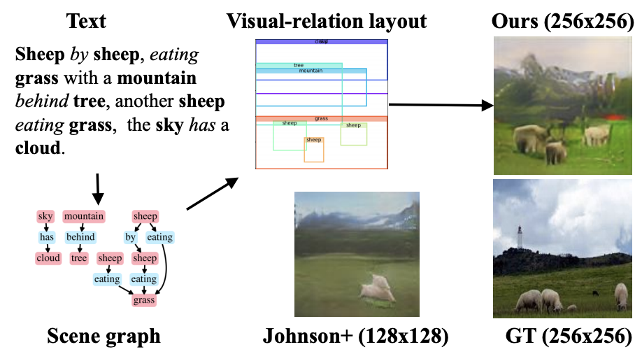
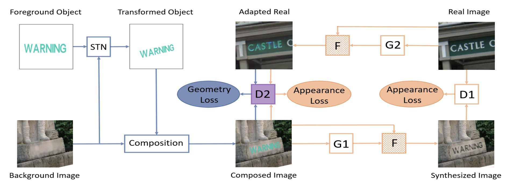
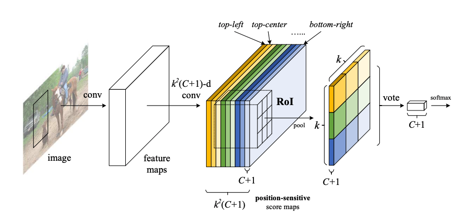
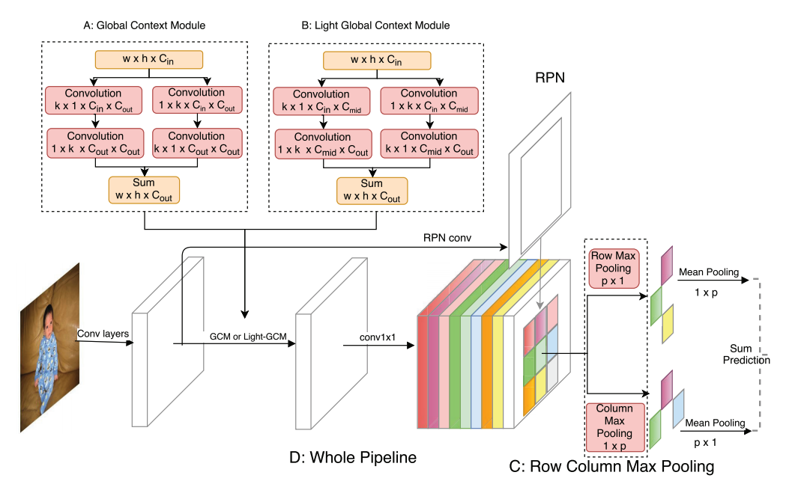
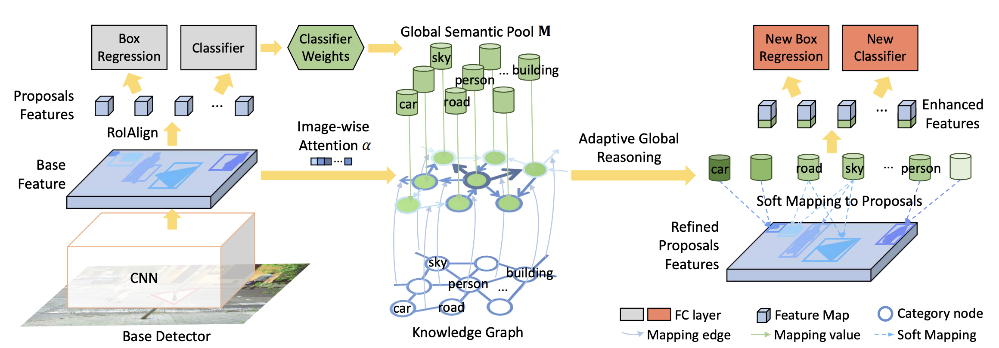
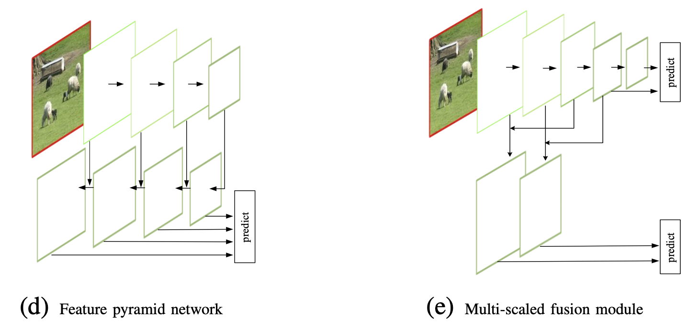
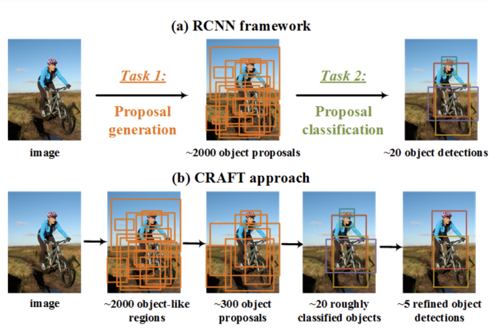
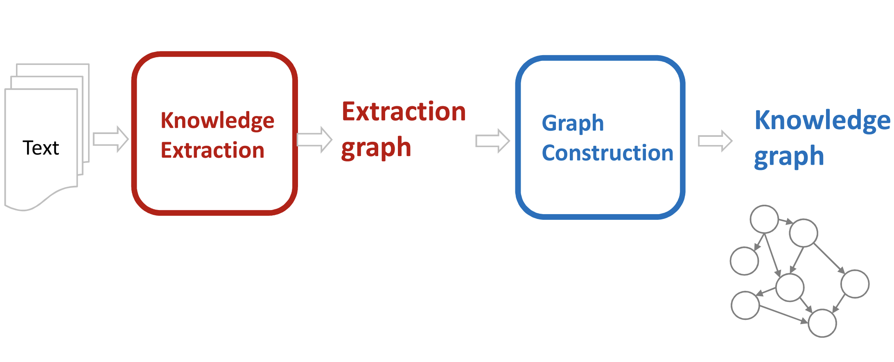

# Paper bookmarks
A collection of arbitrary kinds of computer vision papers, organized by [David Fan](https://github.com/davidhalladay).

Papers are ordered in arXiv submitting time (if applicable).

Feel free to send a PR or an issue.

**TOC**

* [Text to Image](#Text-to-Image)
  * [General](#General)
  * [Bbox constrained](#Bbox-constrained)
* [Image to Image](#Image-to-Image)
  * [General](#General)
  * [Graph](#Graph)
  * [Layout](#Layout)
* [Dialog to Image](#Dialog-to-Image)
* [object detection](#object-detection)
  * [Relation Network](#Relation-Network)
  * [Tiny things](#Tiny-things)
  * [RPN](#RPN)
* [others](#others)

## Text to Image

#### General

| V | Model       | Paper                                                        | Note                                               |
| ---- | ----------- | ------------------------------------------------------------ | ------------------------------------------------------------ |
|  | [Paper](https://arxiv.org/pdf/1511.02793.pdf) | [ICLR2016] GENERATING IMAGES FROM CAPTIONS WITH ATTENTION |  |
| V | [StackGAN](https://arxiv.org/abs/1612.03242) [Code](https://github.com/hanzhanggit/StackGAN) | [ICCV2017]StackGAN: Text to Photo-realistic Image Synthesis with Stacked Generative Adversarial Networks |  |
| | [I2T2I](https://arxiv.org/pdf/1703.06676.pdf) | [2017] I2T2I: LEARNING TEXT TO IMAGE SYNTHESIS WITH TEXTUAL DATA AUGMENTATION | |
|  | [LR-GAN](https://arxiv.org/pdf/1703.01560.pdf) | [ICLR2017] LR-GAN: LAYERED RECURSIVE GENERATIVE ADVERSARIAL NETWORKS FOR IMAGE GENERATION | |
| | [CanvasGAN](https://arxiv.org/pdf/1810.02833.pdf) | [2018] CanvasGAN: A simple baseline for text to image generation by incrementally patching a canvas | We propose a new recurrent generative model for generating images from text captions while attending on specific parts of text captions. |
| V | [StackGAN++](https://arxiv.org/abs/1710.10916) [Code](https://github.com/hanzhanggit/StackGAN-v2) | [TPAMI2018]StackGAN++: Realistic Image Synthesis with Stacked Generative Adversarial Networks |  |
| V | [AttnGAN](https://arxiv.org/abs/1711.10485) [Code](https://github.com/taoxugit/AttnGAN) | [CVPR2018]AttnGAN: Fine-Grained Text to Image Generation with Attentional Generative Adversarial Networks |       |
|      | [HD-GAN](https://arxiv.org/pdf/1802.09178.pdf) [Code](https://github.com/ypxie/HDGan) | [CVPR2018]Photographic Text-to-Image Synthesis with a Hierarchically-nested Adversarial Network |       |
| | [Paper](https://zpascal.net/cvpr2018/Hong_Inferring_Semantic_Layout_CVPR_2018_paper.pdf) | [CVPR2018]Inferring Semantic Layout for Hierarchical Text-to-Image Synthesis | |
|      | [GAN-INT-CLS](https://arxiv.org/abs/1605.05396) | [WSDM2018]Mining Knowledge Graphs from Text |     |
|      | [StoryGAN](https://arxiv.org/abs/1812.02784) [Code](https://github.com/yitong91/StoryGAN) | [CVPR2019]StoryGAN: A Sequential Conditional GAN for Story Visualization |      |
| V | [MirrorGAN](https://arxiv.org/abs/1903.05854) | [CVPR2019]MirrorGAN: Learning Text-to-image Generation by Redescription ||
|      | [DM-GAN](https://arxiv.org/abs/1904.01310) | [CVPR2019] DM-GAN: Dynamic Memory Generative Adversarial Networks for Text-to-Image Synthesis ||
|      | [SD-GAN](https://arxiv.org/abs/1904.01480) | [CVPR2019] Semantics Disentangling for Text-to-Image Generation ||
| V | [Obj-GAN](https://arxiv.org/abs/1902.10740) [Code](https://github.com/jamesli1618/Obj-GAN) | [CVPR2019] Object-driven Text-to-Image Synthesis via Adversarial Training |  |
| V | [Paper](https://arxiv.org/pdf/1811.09845.pdf) | [ICCV2019] Tell, Draw, and Repeat: Generating and Modifying Images Based on Continual Linguistic Instruction | |
| V | [Paper](https://arxiv.org/pdf/1908.01741.pdf) | [2019] Visual-Relation Conscious Image Generation from Structured-Text |  |
|  | [Paper](https://arxiv.org/pdf/1909.00640.pdf) | [2019] Relationship-Aware Spatial Perception Fusion for Realistic Scene Layout Generation |  |
| | [Paper](https://arxiv.org/pdf/1910.13321v1.pdf) | [2019] Semantic Object Accuracy for Generative Text-to-Image Synthesis | a new model that explicitly models individual objects within an image and a new evaluation metric called Semantic Object Accuracy (SOA) |

#### Bbox constrained
| V | Model           | Paper                                                        | Note                                                |
| ---- | --------------- | ------------------------------------------------------------ | ------------------------------------------------------------ |
| V | [GAWWN](https://arxiv.org/abs/1610.02454) [Code](https://github.com/reedscot/nips2016) | [NIPS2016]Learning What and Where to Draw                   |     |
| V | [Object Pathways](https://arxiv.org/abs/1901.00686) [Code](https://github.com/tohinz/multiple-objects-gan) | [ICLR2019]Generating Multiple Objects at Spatially Distinct Locations |  |

## Image to Image
#### General
| V | Model           | Paper                                                        | Note                                                |
| ---- | --------------- | ------------------------------------------------------------ | ------------------------------------------------------------ |
| V | [MC-GAN](https://arxiv.org/pdf/1805.01123.pdf) | [2018] Multi-conditional Generative Adversarial Network for Image Synthesis |  |
| | [SketchyGAN](http://openaccess.thecvf.com/content_cvpr_2018/papers/Chen_SketchyGAN_Towards_Diverse_CVPR_2018_paper.pdf) | [CVPR2018]SketchyGAN: Towards Diverse and Realistic Sketch to Image Synthesis | |
| | [ST-GAN](http://openaccess.thecvf.com/content_cvpr_2018/papers/Lin_ST-GAN_Spatial_Transformer_CVPR_2018_paper.pdf) | [CVPR2018] ST-GAN: Spatial Transformer Generative Adversarial Networks for Image Compositing | |
| V | [Fusion-GAN](https://arxiv.org/pdf/1812.05840.pdf) | [CVPR2019] Spatial Fusion GAN for Image Synthesis |  |
|      | [Text2Scene](https://arxiv.org/abs/1809.01110) [Code](https://github.com/uvavision/Text2Image) | [CVPR2019] Text2Scene: Generating Abstract Scenes from Textual Descriptions |              |

#### Graph 
| V | Model           | Paper                                                        | Note                                                |
| ---- | --------------- | ------------------------------------------------------------ | ------------------------------------------------------------ |
| V | [sg2im](https://arxiv.org/abs/1804.01622) [Code](https://github.com/google/sg2im) | [CVPR2018] Image Generation from Scene Graphs               | Google cloud AI |
| V | [Graph R-CNN](http://openaccess.thecvf.com/content_ECCV_2018/papers/Jianwei_Yang_Graph_R-CNN_for_ECCV_2018_paper.pdf?fbclid=IwAR12RuIzrKti7ojGyGxS-sX6oqLgz-0UbI2IF6cbqsh5i_yccHH4GRGQVfY) | [ECCV2018] Graph R-CNN for Scene Graph Generation               |               |
|      | [Paper](https://arxiv.org/abs/1901.03762) | Using Scene Graph Context to Improve Image Generation        |                            |

#### Layout
| V | Model           | Paper                                                        | Note                                                |
| ---- | --------------- | ------------------------------------------------------------ | ------------------------------------------------------------ |
| V | [Layout2Im](https://arxiv.org/abs/1811.11389) | [CVPR2019] Image Generation from Layout                     |                                                              |
| V | [LayoutGAN](https://openreview.net/forum?id=HJxB5sRcFQ) | [ICLR2019] LayoutGAN: Generating Graphic Layouts with Wireframe Discriminator |                                                    |
|  | [SPADE](http://openaccess.thecvf.com/content_CVPR_2019/papers/Park_Semantic_Image_Synthesis_With_Spatially-Adaptive_Normalization_CVPR_2019_paper.pdf) | [CVPR2019 ]Semantic Image Synthesis With Spatially-Adaptive Normalization | |
| | [LostGANs](https://arxiv.org/pdf/1908.07500.pdf) | [2019] Image Synthesis From Reconfigurable Layout and Style | |

## Dialog to Image

| V    | Model                                                        | Paper                                                        | Note |
| ---- | ------------------------------------------------------------ | ------------------------------------------------------------ | ---- |
|      | [CoDraw](https://arxiv.org/abs/1712.05558) [Code](https://github.com/facebookresearch/CoDraw) | CoDraw: Visual Dialog for Collaborative Drawing              |      |
|      | [ChatPainter](https://arxiv.org/abs/1802.08216)              | [ICLRW2018]ChatPainter: Improving Text to Image Generation using Dialogue |      |
|      | [Paper](https://arxiv.org/abs/1811.09845) [Code](https://github.com/facebookresearch/clevr-dataset-gen) | [NIPSW2018]Keep Drawing It: Iterative language-based image generation and editing |      |
|      | [Chat-crowd](https://arxiv.org/abs/1812.04081) [Code](https://github.com/uvavision/chat-crowd) | Chat-crowd: A Dialog-based Platform for Visual Layout Composition |      |
|      | [SeqAttnGAN](https://arxiv.org/abs/1812.08352)               | [2019]Sequential Attention GAN for Interactive Image Editing via Dialogue |      |

## object detection & Segmentation

#### Classical

| V    | Model                                                        | Paper                                                        | Note                                                         |
| ---- | ------------------------------------------------------------ | ------------------------------------------------------------ | ------------------------------------------------------------ |
|      | [R-FCN](https://arxiv.org/pdf/1605.06409.pdf)                | [NIPS2016] R-FCN: Object Detection via Region-based Fully Convolutional Networks |                                        |
|      | [R-FCN++](https://pdfs.semanticscholar.org/f4a2/732d4051b9c4b5d1f057aaa7935be390f51e.pdf) | [AAAI2018] R-FCN++: Towards Accurate Region-Based Fully Convolutional Networks for Object Detection |                                        |
| V    | [Faster RCNN](https://papers.nips.cc/paper/5638-faster-r-cnn-towards-real-time-object-detection-with-region-proposal-networks.pdf) | [NIPS2017] Faster R-CNN: Towards Real-Time Object Detection with Region Proposal Networks |                                        |
| V    | [Mask RCNN](https://arxiv.org/pdf/1703.06870.pdf)            | [ICCV2017] Mask R-CNN                                        | The method, called Mask R-CNN, extends Faster R-CNN by adding a branch for predicting an object mask in parallel with the existing branch for bounding box recognition. Mask R-CNN is simple to train and adds only a small overhead to Faster R-CNN, running at 5 fps  |

#### Relation Network

| V    | Model                                                        | Paper                                                        | Note                                                         |
| ---- | ------------------------------------------------------------ | ------------------------------------------------------------ | ------------------------------------------------------------ |
|      | [Paper](https://arxiv.org/pdf/1711.11575.pdf?fbclid=IwAR2SKIuG2_Izg7BNl6vhXBlAhkwEVxC2yt0ToP2R2CVg6IFKRqmqa-xd3C4) | [CVPR2018]Relation Networks for Object Detection             | This work proposes an object relation module. It processes a set of objects simultaneously through interaction between their appearance feature and geometry, thus allowing modeling of their relations |
| V    | [Reasoning-RCNN](http://openaccess.thecvf.com/content_CVPR_2019/papers/Xu_Reasoning-RCNN_Unifying_Adaptive_Global_Reasoning_Into_Large-Scale_Object_Detection_CVPR_2019_paper.pdf) | [CVPR2019]Reasoning-RCNN: Unifying Adaptive Global Reasoning into Large-scale Object Detection |                                        |
|      |                                                              |                                                              |                                                              |

#### Tiny things
| V    | Model                                           | Paper                                                        | Note                                                         |
| ---- | ----------------------------------------------- | ------------------------------------------------------------ | ------------------------------------------------------------ |
|      | [FPN](https://arxiv.org/pdf/1612.03144.pdf)     | [CVPR2017]Feature Pyramid Networks for Object Detection      |                                                              |
|      | [MDSSD](https://arxiv.org/pdf/1805.07009v2.pdf) | [2018]MDSSD: Multi-scale Deconvolutional Single Shot Detector for Small Objects |                                        |
|      | [Paper](https://arxiv.org/pdf/1902.07296.pdf)   | [2019]Augmentation for small object detection                | We conjecture this is due to two factors; (1) only a few images are containing small objects, and (2) small objects do not appear enough even within each image containing them. We thus propose to oversample those images with small objects and augment each of those images by copy-pasting small objects many times |
|      | [Paper](https://arxiv.org/pdf/1901.01892.pdf)   | [ICCV2019] Scale-Aware Trident Networks for Object Detection |                                        |
|      | [Paper](https://arxiv.org/pdf/1902.06042.pdf)   | [2019]R^2 -CNN: Fast Tiny Object Detection in Large-scale Remote Sensing Images |                                                              |

#### RPN
| V    | Model                                                        | Paper                                                        | Note                                                         |
| ---- | ------------------------------------------------------------ | ------------------------------------------------------------ | ------------------------------------------------------------ |
|      | [Faster-RCNN](https://papers.nips.cc/paper/5638-faster-r-cnn-towards-real-time-object-detection-with-region-proposal-networks) | [NIPS2015]Faster R-CNN: Towards Real-Time Object Detection with Region Proposal Networks |                                                              |
|      | [Anchor-free RPN](https://arxiv.org/abs/1804.09003)          | [2018] An Anchor-Free Region Proposal Network for Faster R-CNN based Text Detection Approaches | In order to better enclose scene text instances of various shapes, it requires to design anchors of various scales, aspect ratios and even orientations manually, which makes anchorbased methods sophisticated and inefficient Compared with a vanilla RPN and FPN-RPN, AF-RPN can get rid of complicated anchor design and achieve higher recall rate on large-scale COCO-Text dataset. |
|      | [CRAFT](https://arxiv.org/pdf/1604.03239.pdf)                | [CVPR2016] CRAFT Objects from Images                         |                                        |
|      | [Siamese RPN](http://openaccess.thecvf.com/content_cvpr_2018/papers/Li_High_Performance_Visual_CVPR_2018_paper.pdf) | [CVPR2018] High Performance Visual Tracking with Siamese Region Proposal Network |                                        |
|      | [Siamese cRPN](https://zpascal.net/cvpr2019/Fan_Siamese_Cascaded_Region_Proposal_Networks_for_Real-Time_Visual_Tracking_CVPR_2019_paper.pdf) | [CVPR2019] Siamese Cascaded Region Proposal Networks for **Real-Time Visual Tracking** | previously proposed one-stage Siamese-RPN trackers degenerate in presence of similar distractors and large scale variation. Addressing these issues, we propose a multi-stage tracking framework, Siamese Cascaded RPN (C-RPN), which consists of a sequence of RPNs cascaded from deep high-level to shallow low-level layers in a Siamese network. |
|      | [Enhanced-PRN](https://journals.plos.org/plosone/article/file?id=10.1371/journal.pone.0203897&type=printable) | [PLOS2018] An Enhanced Region Proposal Network for object detection using deep learning method |                                                              |

## other

| V    | Model                                                        | Paper                                                        | Note                                                         |
| ---- | ------------------------------------------------------------ | ------------------------------------------------------------ | ------------------------------------------------------------ |
|      | [BSC-GAN](https://www.researchgate.net/publication/327630853_BSCGAN_Deep_Background_Subtraction_with_Conditional_Generative_Adversarial_Networks) | [ICIP2018] Deep Background Subtraction with Conditional Generative Adversarial Networks | This paper proposes a deep background subtraction method based on conditional Generative Adversarial Network (cGAN) |
|      | [Paper](http://mi.eng.cam.ac.uk/~cipolla/publications/inproceedings/2018-CVPR-multi-task-learning.pdf?fbclid=IwAR2alX5p6v2xVq2GFSPri2mAov7UFK8S8egOWWhsOd29k1JRockLjBazGxI) | [CVPR2018] Multi-Task Learning Using Uncertainty to Weigh Losses for Scene Geometry and Semantics |                                                              |
|      | [Paper](https://kgtutorial.github.io)                        | [CVPR2018]Relation Networks for Object Detection             |                                        |
|      | [Paper](https://zpascal.net/cvpr2019/Chen_Multi-Label_Image_Recognition_With_Graph_Convolutional_Networks_CVPR_2019_paper.pdf) | [CVPR2019]Multi-Label Image Recognition with Graph Convolutional Networks∗ |                                                              |
|      | [Paper](https://arxiv.org/pdf/1909.09953.pdf)                | [2019] Learning Visual Relation Priors for Image-Text Matching and Image Captioning with Neural Scene Graph Generators |                                                              |
|      | [Paper](https://arxiv.org/pdf/1909.05370.pdf)                | [2019] An Auxiliary Classifier Generative Adversarial Framework for Relation Extraction |                                                              |
|      |                                                              |                                                              |                                                              |